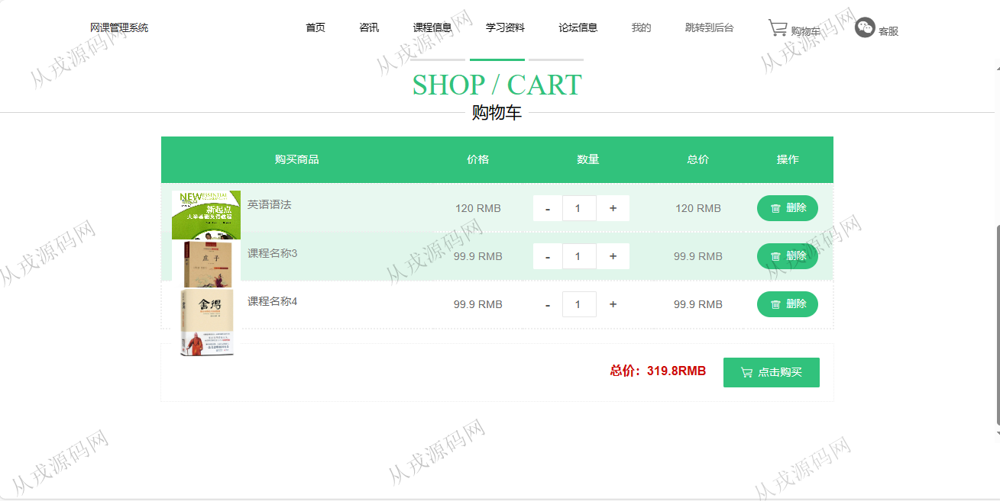

<h1 align="center">222.网课管理系统</h1>

 获取sql文件 QQ: 386869957 QQ群: 377586148 

 [更多源码项目: 从戎源码网](https://armycodes.com/) 

## 简介

> 本代码来源于网络,仅供学习参考使用!
>
> 提供1.远程部署/2.修改代码/3.设计文档指导/4.框架代码讲解等服务
>
> http://localhost:8080/jspm3t9ai/front/index.jsp
> 
> http://localhost:8080/jspm3t9ai/jsp/login.jsp
>
> admin 123456

## 项目介绍
基于ssm的网课管理系统：前端 jsp、jquery、bootstrap，后端 maven、springmvc、spring、mybatis；角色分为管理员、用户；集成课程信息展示、课程购买、购物车、在线结算等功能于一体的系统。

## 功能介绍

### 用户

- 基本功能：登录，注册，退出
- 网站首页：主导航栏，轮播图，推荐资讯展示，推荐课程展示
- 课程信息：课程列表展示，按课程名称和类型搜索，课程详情，收藏，评价，加入购物车，购物车列表，购物车结算，在线支付（模拟）
- 资讯：资讯列表展示，按标题和类型搜索，资讯详情
- 学习资料：学习资料列表展示，按资料名称和类型搜索，资料详情，课程文件下载，做笔记，收藏，评价，学习视频在线播放
- 我的：个人信息查看与修改，我的发布，我的订单，我的地址，我的收藏

### 管理员

- 学生管理：学生信息的增删改查，学生可以由前台系统自行注册
- 资讯管理：资讯信息的增删改查，资讯图片上传，按标题和类型搜索
- 课程类型管理：类型信息的增删改查，课程类型搜索
- 课程信息管理：课程信息的增删改查，课程图片上传，按名称和类型搜索课程
- 学习资料管理：学习资料信息的增删改查，资料上传和下载，视频在线播放
- 订单管理：管理员查看用户的订单信息，对订单进行修改或删除操作

## 环境

- <b>IntelliJ IDEA 2021.3</b>

- <b>Mysql 5.7.26</b>

- <b>Tomcat 7.0.73</b>

- <b>JDK 1.8</b>

## 运行截图

